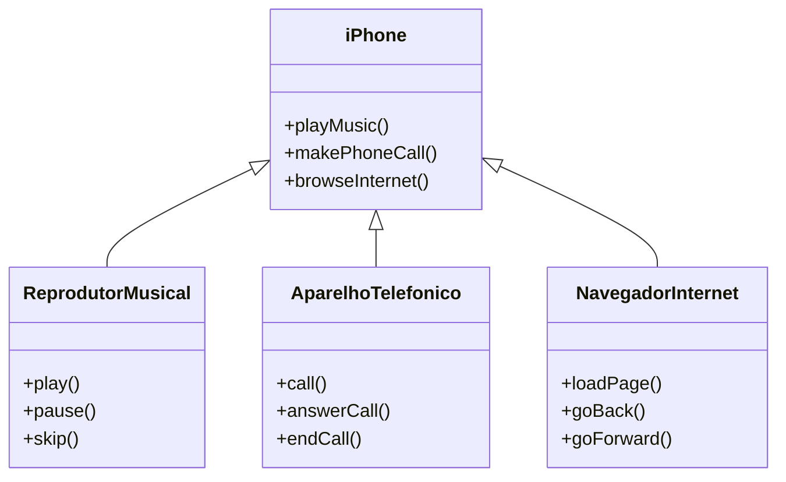

# desafio-codigo-iphone

## Diagrama de classe

```mermaid
classDiagram
    class iPhone {
        +playMusic()
        +makePhoneCall()
        +browseInternet()
    }
    class ReprodutorMusical {
        +play()
        +pause()
        +skip()
    }
    class AparelhoTelefonico {
        +call()
        +answerCall()
        +endCall()
    }
    class NavegadorInternet {
        +loadPage()
        +goBack()
        +goForward()
    }

    iPhone <|-- ReprodutorMusical
    iPhone <|-- AparelhoTelefonico
    iPhone <|-- NavegadorInternet
```
